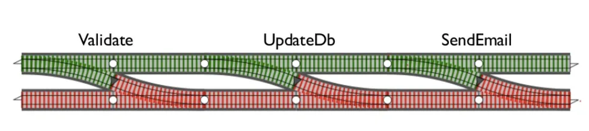

- [Railway Oriented Programming (ROP)](#railway-oriented-programming-rop)
  - [Estructuras de Datos: Either y Result](#estructuras-de-datos-either-y-result)
  - [Librerías](#librerías)
  - [Ventajas](#ventajas)
  - [Happy Path](#happy-path)
  - [Más sobre Excepciones o Result](#más-sobre-excepciones-o-result)
    - [Ejemplo con Excepciones](#ejemplo-con-excepciones)
      - [Validación de la Solicitud](#validación-de-la-solicitud)
      - [Transformación de Datos](#transformación-de-datos)
      - [Almacenamiento en la Base de Datos](#almacenamiento-en-la-base-de-datos)
      - [Encadenando Operaciones con Excepciones](#encadenando-operaciones-con-excepciones)
    - [Análisis del Enfoque con Excepciones](#análisis-del-enfoque-con-excepciones)
    - [Ejemplo con Either](#ejemplo-con-either)
      - [Validación de la Solicitud](#validación-de-la-solicitud-1)
      - [Transformación de Datos](#transformación-de-datos-1)
      - [Almacenamiento en la Base de Datos](#almacenamiento-en-la-base-de-datos-1)
      - [Encadenando Operaciones con Either](#encadenando-operaciones-con-either)
    - [Análisis del Enfoque con Either](#análisis-del-enfoque-con-either)
    - [Comparación y Conclusión](#comparación-y-conclusión)

# Railway Oriented Programming (ROP)

Railway Oriented Programming es un estilo de programación que se centra en manejar flujos de datos que pueden tener éxito o fallar en cualquier punto. La idea principal es modelar las operaciones como si fueran vías de tren: una vía representa el camino del éxito y otra el camino del fallo.



## Estructuras de Datos: Either y Result
En ROP, utilizamos estructuras de datos como Either<L, R> o Result<T, Err> para representar estos dos posibles estados.

- Either<L, R>: Either es una estructura de datos que puede contener un valor de dos tipos posibles: L (normalmente usado para errores) o R (normalmente usado para éxitos).
- Result<T, Err>: Result es otra estructura que se utiliza para representar operaciones que pueden fallar. En Kotlin, la librería estándar no tiene Result con dos tipos, pero puedes usar una librería externa o definir la tuya propia.

## Librerías
- Arrow: https://arrow-kt.io/ (https://www.baeldung.com/kotlin/arrow)
- Kotlin Result: https://github.com/michaelbull/kotlin-result (https://github.com/michaelbull/kotlin-result/wiki)
- VAVR: https://www.vavr.io/ (https://www.baeldung.com/vavr-either)

## Ventajas
Ventajas sobre el uso de Excepciones
- Claridad y Mantenibilidad: El flujo de datos es explícito. No hay necesidad de capturar excepciones en cada nivel.
- Composición: Es más fácil componer funciones que pueden fallar.
- Control de Errores: Los errores se manejan en el tipo del dato, no en el flujo de control.

## Happy Path
En ROP, el "happy path" es el flujo de ejecución donde todo funciona correctamente. El objetivo es mantener este flujo limpio y legible, mientras que los errores se manejan de manera explícita y predecible.

Ejemplo: Procesamiento de una Solicitud de Usuario

Supongamos que estamos desarrollando una aplicación que recibe solicitudes de los usuarios. Este proceso incluye varias etapas: validación de la solicitud, transformación de datos, y almacenamiento en una base de datos. Cada una de estas etapas puede fallar.

Primero, definimos nuestras funciones que representan cada etapa del proceso:

Validación de la Solicitud:

```kotlin
fun validateRequest(request: String): Either<String, String> {
    return if (request.isNotEmpty()) {
        Either.Right(request)
    } else {
        Either.Left("Request cannot be empty")
    }
}
```	
Transformación de Datos:

```kotlin	
fun transformData(data: String): Either<String, Int> {
    return try {
        Either.Right(data.toInt())
    } catch (e: NumberFormatException) {
        Either.Left("Invalid number format")
    }
}

```	
Almacenamiento en la Base de Datos:

```kotlin	
fun saveToDatabase(number: Int): Either<String, Boolean> {
    return if (number > 0) {
        Either.Right(true)
    } else {
        Either.Left("Number must be positive")
    }
}
```	

Encadenando Operaciones

Ahora, queremos encadenar estas operaciones de manera que si alguna falla, el flujo se detenga y el error se propague. Utilizando flatMap, podemos mantener el "happy path" limpio y manejable:

```kotlin
fun processRequest(request: String): Either<String, Boolean> {
    return validateRequest(request)
        .flatMap { validRequest -> transformData(validRequest) }
        .flatMap { number -> saveToDatabase(number) }
}
````

````kotlin
fun main() {
    val result = processRequest("123")
    when (result) {
        is Either.Right -> println("Success: ${result.value}")
        is Either.Left -> println("Error: ${result.value}")
    }
}
```
En este ejemplo, processRequest intenta validar la solicitud, transformar los datos y guardarlos en la base de datos. Si alguna de estas operaciones falla, el error se propaga y se detiene el flujo.


### Ventajas sobre el Uso de Excepciones

- Flujo de Control Predecible:Con excepciones, el flujo de control puede ser difícil de seguir, ya que las excepciones pueden lanzarse desde cualquier punto y deben ser capturadas en otro lugar.
Con Either o Result, el flujo de control es explícito y fácil de seguir. Sabes exactamente dónde y cómo se manejan los errores.

- Composición de Funciones:Las funciones que utilizan excepciones son difíciles de componer porque debes capturar y manejar las excepciones en cada nivel.
Las funciones que devuelven Either o Result son fáciles de componer utilizando flatMap, lo que permite encadenar operaciones de manera limpia.

- Errores como Valores: Las excepciones son una forma de control de flujo que puede ser difícil de manejar y probar.
Con Either o Result, los errores se tratan como valores, lo que facilita el manejo y las pruebas.
Happy Path y Manejo de Errores


Ejemplo: Registro de Usuarios
Supongamos que tenemos un proceso de registro de usuarios que incluye verificar la disponibilidad del nombre de usuario, validar la contraseña y guardar los datos del usuario.

Verificar Disponibilidad del Nombre de Usuario:

````kotlin
fun checkUsernameAvailability(username: String): Either<String, String> {
    return if (username != "takenUsername") {
        Either.Right(username)
    } else {
        Either.Left("Username is already taken")
    }
}
````	
Validar Contraseña:

````kotlin
fun validatePassword(password: String): Either<String, String> {
    return if (password.length >= 8) {
        Either.Right(password)
    } else {
        Either.Left("Password must be at least 8 characters long")
    }
}
````

Guardar Usuario en la Base de Datos:

````kotlin
fun saveUser(username: String, password: String): Either<String, Boolean> {
    // Simulamos el guardado en la base de datos
    return Either.Right(true)
}
````	

Encadenando el Proceso de Registro
````kotlin
fun registerUser(username: String, password: String): Either<String, Boolean> {
    return checkUsernameAvailability(username)
        .flatMap { availableUsername -> validatePassword(password).map { availableUsername to it } }
        .flatMap { (validUsername, validPassword) -> saveUser(validUsername, validPassword) }
}
````
````kotlin	
fun main() {
    val registrationResult = registerUser("newUser", "securePassword")
    when (registrationResult) {
        is Either.Right -> println("Registration successful")
        is Either.Left -> println("Registration failed: ${registrationResult.value}")
    }
}
````	
En este ejemplo, registerUser encadena las operaciones de verificación de nombre de usuario, validación de contraseña y guardado del usuario. Si alguna de estas operaciones falla, el flujo se detiene y el error se propaga.


## Más sobre Excepciones o Result

### Ejemplo con Excepciones

Primero, implementemos las funciones utilizando excepciones para manejar los errores.

#### Validación de la Solicitud
```kotlin
fun validateRequest(request: String): String {
    if (request.isNotEmpty()) {
        return request
    } else {
        throw IllegalArgumentException("Request cannot be empty")
    }
}
```

#### Transformación de Datos
```kotlin
fun transformData(data: String): Int {
    return try {
        data.toInt()
    } catch (e: NumberFormatException) {
        throw IllegalArgumentException("Invalid number format")
    }
}
```

#### Almacenamiento en la Base de Datos
```kotlin
fun saveToDatabase(number: Int): Boolean {
    if (number > 0) {
        return true
    } else {
        throw IllegalArgumentException("Number must be positive")
    }
}
```

#### Encadenando Operaciones con Excepciones
```kotlin
fun processRequest(request: String): Boolean {
    return try {
        val validRequest = validateRequest(request)
        val number = transformData(validRequest)
        saveToDatabase(number)
    } catch (e: IllegalArgumentException) {
        println("Error: ${e.message}")
        false
    }
}

fun main() {
    val result = processRequest("123")
    println("Result: $result")
}
```

### Análisis del Enfoque con Excepciones

- **Manejo Implícito**: El manejo de errores está disperso en el código y es menos explícito.
- **Acoplamiento**: El control del flujo y el manejo de errores están estrechamente acoplados, lo que hace el código más difícil de mantener.
- **Legibilidad**: Cada función debe conocer el contexto de cómo se manejarán las excepciones, lo que puede hacer el código menos legible.

### Ejemplo con Either

Ahora implementemos el mismo ejemplo utilizando `Either<L, R>`.

#### Validación de la Solicitud
```kotlin
fun validateRequest(request: String): Either<String, String> {
    return if (request.isNotEmpty()) {
        Either.Right(request)
    } else {
        Either.Left("Request cannot be empty")
    }
}
```

#### Transformación de Datos
```kotlin
fun transformData(data: String): Either<String, Int> {
    return try {
        Either.Right(data.toInt())
    } catch (e: NumberFormatException) {
        Either.Left("Invalid number format")
    }
}
```

#### Almacenamiento en la Base de Datos
```kotlin
fun saveToDatabase(number: Int): Either<String, Boolean> {
    return if (number > 0) {
        Either.Right(true)
    } else {
        Either.Left("Number must be positive")
    }
}
```

#### Encadenando Operaciones con Either
```kotlin
fun processRequest(request: String): Either<String, Boolean> {
    return validateRequest(request)
        .flatMap { validRequest -> transformData(validRequest) }
        .flatMap { number -> saveToDatabase(number) }
}

fun main() {
    val result = processRequest("123")
    when (result) {
        is Either.Right -> println("Success: ${result.value}")
        is Either.Left -> println("Error: ${result.value}")
    }
}
```

### Análisis del Enfoque con Either

- **Manejo Explícito**: El manejo de errores es explícito y parte del flujo de datos, lo que facilita el seguimiento.
- **Desacoplamiento**: El manejo de errores y el control del flujo están desacoplados, haciendo el código más fácil de mantener.
- **Legibilidad**: Cada función se centra solo en su lógica, sin preocuparse por el manejo de excepciones. El encadenamiento con `flatMap` mantiene el "happy path" limpio y legible.

### Comparación y Conclusión

1. **Control del Flujo con Excepciones**:
    - En el ejemplo con excepciones, el flujo del programa puede interrumpirse en cualquier punto con una excepción, y debemos asegurarnos de capturar todas las excepciones en un bloque `try-catch`.
    - La lógica de manejo de errores se mezcla con la lógica principal, dificultando tanto la lectura como el mantenimiento.

2. **Control del Flujo con Either**:
    - En el ejemplo con `Either`, el flujo de datos y los errores se manejan de manera explícita y predecible.
    - El "happy path" se mantiene limpio, y los errores se propagan automáticamente a través del encadenamiento de operaciones, mejorando la claridad y la mantenibilidad del código.

Al comparar ambos enfoques, es evidente que `Either` proporciona un mejor manejo de errores, facilitando la composición de funciones y manteniendo el flujo de control claro y predecible. Esto hace que el código sea más robusto y fácil de seguir.