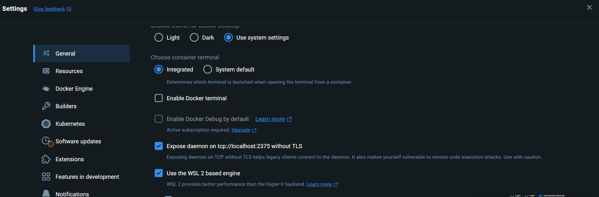

- [TestContainers](#testcontainers)
  - [¿Para qué se usan los Testcontainers?](#para-qué-se-usan-los-testcontainers)
  - [¿Por qué son recomendables los Testcontainers?](#por-qué-son-recomendables-los-testcontainers)
  - [¿Qué aportan los Testcontainers al desarrollo?](#qué-aportan-los-testcontainers-al-desarrollo)
  - [Ejemplo de Uso de Testcontainers](#ejemplo-de-uso-de-testcontainers)
  - [Como usarlo en un Docker Multietapa](#como-usarlo-en-un-docker-multietapa)
    - [Windows con Docker Desktop](#windows-con-docker-desktop)
    - [Linux](#linux)
    - [Construcción del Contenedor](#construcción-del-contenedor)
    - [Dockerfile](#dockerfile)


## TestContainers
Testcontainers es una biblioteca de que proporciona contenedores Docker ligeros y desechables para pruebas automatizadas. Permite a los desarrolladores ejecutar pruebas de integración que dependen de servicios externos como bases de datos, colas de mensajes, navegadores web y más, en un entorno controlado y replicable.

### ¿Para qué se usan los Testcontainers?

Los Testcontainers se utilizan principalmente para pruebas de integración y pruebas de extremo a extremo. Permiten a los desarrolladores:

1. **Probar con bases de datos reales**: Puedes lanzar una instancia real de una base de datos (como PostgreSQL, MySQL, MongoDB, etc.) y ejecutar tus pruebas contra ella.
2. **Probar con otros servicios externos**: Puedes lanzar contenedores para otros servicios externos como Kafka, Redis, Elasticsearch, Selenium Grid, etc.
3. **Entorno de prueba aislado y consistente**: Cada prueba puede ejecutarse en un entorno limpio y aislado, lo que reduce la posibilidad de interferencias entre pruebas.

### ¿Por qué son recomendables los Testcontainers?

1. **Aislamiento de Pruebas**: Cada prueba se ejecuta en un contenedor limpio y aislado, lo que asegura que no haya interferencias entre pruebas.
2. **Reproducibilidad**: Los contenedores Docker aseguran que las pruebas se ejecuten en un entorno consistente, independientemente de la máquina en la que se ejecuten.
3. **Facilidad de Configuración**: Testcontainers facilita la configuración y el uso de servicios externos en las pruebas. No necesitas instalar y configurar manualmente estos servicios en tu entorno de desarrollo.
4. **Flexibilidad**: Puedes lanzar cualquier servicio que esté disponible como una imagen de Docker, lo que te da una gran flexibilidad para probar con diferentes versiones y configuraciones.
5. **Integración con JUnit y otros frameworks de prueba**: Testcontainers se integra fácilmente con JUnit y otros frameworks de prueba, lo que facilita su uso en proyectos existentes.

### ¿Qué aportan los Testcontainers al desarrollo?

1. **Calidad del Código**: Al permitir pruebas más completas y realistas, Testcontainers ayuda a detectar errores que podrían no ser visibles en pruebas unitarias o en entornos de prueba menos realistas.
2. **Confianza en el Código**: Saber que tu código ha sido probado en un entorno que se asemeja mucho al de producción aumenta la confianza en que funcionará correctamente cuando se despliegue.
3. **Reducción de Errores en Producción**: Al probar con versiones reales de servicios externos, puedes detectar y corregir problemas que podrían surgir debido a diferencias entre el entorno de desarrollo y el de producción.
4. **Automatización de Pruebas**: Facilita la integración de pruebas de integración y de extremo a extremo en tu pipeline de CI/CD, lo que mejora la automatización y la eficiencia del proceso de desarrollo.
5. **Menos Dependencias Manuales**: No necesitas depender de servicios externos configurados manualmente en tu entorno de desarrollo o CI/CD, lo que simplifica la configuración y reduce la posibilidad de errores de configuración.

### Ejemplo de Uso de Testcontainers

Para ilustrar cómo se utilizan los Testcontainers, considera el siguiente ejemplo donde configuramos un contenedor PostgreSQL para pruebas en Gradle

```kotlin
// Test Containers
    testImplementation("org.testcontainers:testcontainers:1.20.2")
    testImplementation("org.testcontainers:junit-jupiter:1.20.2")
    testImplementation("org.testcontainers:postgresql:1.20.2")
```	

Luego, en la clase de prueba, puedes configurar y usar el contenedor de la siguiente manera:

```kotlin
Testcontainers // Necesario para TestContainers
@TestMethodOrder(MethodOrderer.OrderAnnotation.class) // Ordenar las pruebas (opcional)
class PersonasRepositoryImplTest {

    // Configurar un contenedor PostgreSQL
    @Container
    public static PostgreSQLContainer<?> postgresContainer = new PostgreSQLContainer<>("postgres:12-alpine")
            .withDatabaseName("testdb") // Nombre de la base de datos
            .withUsername("test") // Usuario
            .withPassword("test") // Contraseña
            .withInitScript("init-personas-db.sql"); // Script de inicialización en resources de test, no es necesario, puedes    hacerlo manualmente

    private static DataBaseManager dataBaseManager; // Implementación de la conexión a la base de datos
    private static PersonasRepositoryImpl personasRepository; // Repositorio de personas

    @BeforeAll
    public static void setUp() throws SQLException {
        // Configurar el DataBaseManager para que use el contenedor de PostgreSQL
        // Sobreescibir el método connect para que use la conexión del contenedor de test 
        dataBaseManager = new DataBaseManager() {
            @Override
            public Connection connect() throws SQLException {
                return DriverManager.getConnection(
                        postgresContainer.getJdbcUrl(),
                        postgresContainer.getUsername(),
                        postgresContainer.getPassword()
                );
            }
        };

        // Inicializar el repositorio de personas
        personasRepository = new PersonasRepositoryImpl(dataBaseManager);
    }

    @AfterAll
    public static void tearDown() {
        if (postgresContainer != null) {
            postgresContainer.stop(); // Paramos el contenedor
        }
    }


    @Test
    @Order(1)
    public void testGetAll() {
      // Ahora podemos ejecutar pruebas contra la base de datos PostgreSQL del contenedor de test
        List<Persona> personas = personasRepository.getAll();

        assertAll(() -> {
            assertNotNull(personas);
            assertEquals(1, personas.size());
            assertEquals("Test 01", personas.getFirst().getNombre());
        });

    }
```

En este ejemplo, configuramos un contenedor PostgreSQL en la clase de prueba y lo usamos para ejecutar pruebas contra una base de datos real. Al hacerlo, podemos asegurarnos de que nuestras pruebas se ejecuten en un entorno controlado y aislado, lo que aumenta la confiabilidad y la calidad de las pruebas.


### Como usarlo en un Docker Multietapa
Cuando usamos Docker Multietapa, podemos usar Testcontainers para ejecutar pruebas de integración en el contenedor de compilación. Esto nos permite probar nuestra aplicación en un entorno similar al de producción antes de desplegarla.
¿Pero podemos usar Docker cliente dentro de un Docker contenedor? La respuesta es sí, pero necesitamos configurar el contenedor para que pueda comunicarse con el demonio de Docker en el host. 

Para ello vamos a usar `host.docker.internal` que es una dirección especial que Docker asigna a la máquina host desde un contenedor. De esta forma, podemos comunicarnos con el demonio de Docker en el host desde un contenedor. De esta manera podemos poner en nuestro Dockerfile de pruebas `ENV DOCKER_HOST=tcp://host.docker.internal:2375` para que Testcontainers pueda comunicarse con el demonio de Docker en el host.

¿Cómo funciona host.docker.internal?
Windows y macOS: Docker Desktop proporciona automáticamente host.docker.internal para que los contenedores puedan acceder al host. No se requiere configuración adicional.
Linux: Docker no proporciona automáticamente host.docker.internal en Linux. Sin embargo, puedes lograr un comportamiento similar mediante la configuración manual del alias en el archivo /etc/hosts o utilizando la red host de Docker.

#### Windows con Docker Desktop
Docker Desktop Settings: Asegúrate de que Docker Desktop esté configurado para exponer el daemon de Docker en tcp://localhost:2375 sin TLS. Puedes hacerlo desde las configuraciones de Docker Desktop:

Abre Docker Desktop.
Ve a Settings > General.
Asegúrate de que la opción Expose daemon on tcp://localhost:2375 without TLS esté habilitada.
Permisos del Firewall: Asegúrate de que tu firewall no esté bloqueando el puerto 2375.
Seguridad: Exponer el Docker daemon sin TLS puede ser un riesgo de seguridad. Esto debería hacerse solo en entornos de desarrollo y no en producción.



#### Linux
Configurar el Docker Daemon para que escuche en TCP
Para que Docker escuche en una dirección TCP, necesitas modificar el archivo de configuración del daemon. Abre el archivo /etc/docker/daemon.json (créalo si no existe) y agrega la configuración necesaria:

{
  "hosts": ["unix:///var/run/docker.sock", "tcp://0.0.0.0:2375"]
}
Luego, reinicia el servicio Docker para aplicar los cambios: `sudo systemctl restart docker`

#### Construcción del Contenedor
Usa el argumento DOCKER_HOST_ARG para pasar el valor correcto de DOCKER_HOST según el sistema operativo:

- Para Windows: `docker build --build-arg DOCKER_HOST_ARG=tcp://host.docker.internal:2375 -t my-app .`
- Para Linux y macOS: `docker build --build-arg DOCKER_HOST_ARG=tcp://localhost:2375 -t my-app .`

#### Dockerfile
```dockerfile
# Etapa de compilación, un docker especifico, que se etiqueta como build
FROM gradle:jdk21-alpine AS build

# Directorio de trabajo
WORKDIR /app

# Copia los archivos build.gradle y src de nuestro proyecto
COPY build.gradle.kts .
COPY gradlew .
COPY gradle gradle
COPY src src

# Configura la variable de entorno DOCKER_HOST, esto es para que el contenedor pueda comunicarse con el host
# En Windows se usa host.docker.internal, en Linux y macOS se puede usar localhost
ARG DOCKER_HOST_ARG=tcp://host.docker.internal:2375
ENV DOCKER_HOST=$DOCKER_HOST_ARG


# Compila y construye el proyecto, podemos evitar los test evitando con -x test
RUN ./gradlew build

# Etapa de ejecución, un docker especifico, que se etiqueta como run
# Con una imagen de java, solo neceistamos el jre
FROM eclipse-temurin:21-jre-alpine AS run

# Directorio de trabajo
WORKDIR /app

# Copia el jar de la aplicación, ojo que esta en la etapa de compilación, etiquetado como build
# Cuidado con la ruta definida cuando has copiado las cosas en la etapa de compilación
# Para copiar un archivo de una etapa a otra, se usa la instrucción COPY --from=etapaOrigen
COPY --from=build /app/build/libs/*SNAPSHOT.jar /app/my-app.jar

# Ejecuta el jar
ENTRYPOINT ["java","-jar","/app/my-app.jar"]
```